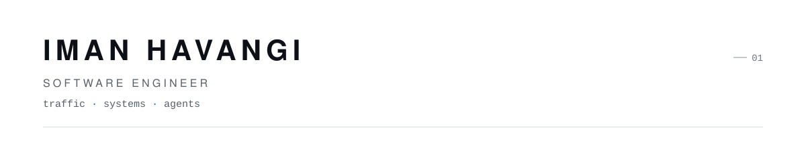

<picture>
  <source media="(prefers-color-scheme: dark)" srcset="assets/header-dark.svg">
  
</picture>

I engineer large-scale traffic — CDN, edge, and the networks beneath them. I work AI-native: agents in the loop, assumptions out of it.

20+ products shipped across fintech, healthcare, and IoT. Now: CDN infrastructure at [GreenPlus](https://greenplus.cloud/).

## Selected work

**[NoAssume ↗](https://github.com/imanhavangi/NoAssume)**  
Clarification guardrails for coding agents — stop coding on assumptions.  
*developer tooling · ai agents*

**[NetVibe ↗](https://github.com/imanhavangi/NetVibe)**  
Crowdsourced, real-time network monitoring platform.  
*product engineering · backend · infrastructure*

**[Tunneling Methods ↗](https://github.com/imanhavangi/Tunneling-Methods-Between-Two-Servers)**  
Practical techniques for keeping servers connected under constrained network conditions.  
*networking · linux*

Also shipped: [Alpha](https://cafebazaar.ir/app/com.vira.alpha) — AI language learning, 2,900+ installs · [Solana Smart Home](https://solanasmart.com/) — IoT platform.

## I work around

CDN & edge · Networking  
Distributed systems · Infrastructure  
AI agents · Developer tooling

`Python` · `Django` · `FastAPI` · `Flutter` · `TypeScript`  
`Docker` · `Linux` · `Nginx` · `PostgreSQL` · `Redis`

> Traffic doesn't lie.  
> Neither does production.  
> Everything else is opinion.

BSc, Computer Engineering

[website ↗](https://imanhavangi.ir) · [linkedin ↗](https://www.linkedin.com/in/imanhavangi) · [telegram ↗](https://t.me/imanhavangi) · [instagram ↗](https://www.instagram.com/imanhavangi.dev) · [email ↗](mailto:imanhavangi20@gmail.com)
